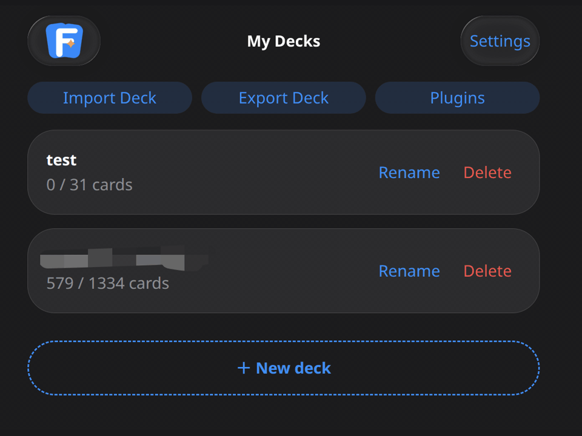

# OpenFlash

English | [中文](#openflash-中文说明)


A self-hosted two-sided flashcard app with spaced-repetition scheduling, AI explanations, and local text-to-speech.

Turn words, phrases, sentences, or web clippings into cards and review them on a memory curve. Let AI explain a card or fill in its empty side, and have English content read aloud by a local TTS service.



---

## Use Cases

- Turn notes from a course, textbook, or paper into two-sided cards and review them daily on a memory curve, whatever the subject.
- Prep for an exam or certification: collect the material into a deck and clear a fixed batch every day.
- Save text while reading articles or papers, then work through it later without breaking your reading flow.
- Turn interview questions, term definitions, legal clauses, or API signatures into Q&A cards and quiz yourself in both directions.
- Learning English specifically: the AI explanation and read-aloud plugins default to English, and every deck can customize its own AI prompt for other languages or subjects.

---

## Features

- **Accounts, decks, and cards** — full management of your own learning data.
- **Two-sided cards** — text and images on both the A side and the B side.
- **Daily practice** — review scheduling on a memory curve, in A→B, B→A, or random two-way mode.
- **Per-deck settings** — daily new-card limit, review load, auto-speak, and AI prompts are configured per deck.
- **Mastered cards** — move mastered cards out of practice and restore them later.
- **Plugin market** — enable AI explanation, AI side completion, TTS, and mask mode per deck.
- **Browser extension** — import selected web text via right-click, or create cards manually.

---

## Tech Stack

| Area             | Technology                                       |
| ---------------- | ------------------------------------------------ |
| Frontend         | React 19, React Router 7, Vite 6, Tailwind CSS 4, Konsta UI |
| Backend          | Spring Boot 4, Spring Web MVC, MyBatis, PostgreSQL 17 |
| Migration        | Flyway                                           |
| Session          | Spring Session JDBC                              |
| Memory algorithm | FSRS                                             |
| AI               | Spring AI 2.0 — per-user provider, encrypted API key |
| Speech           | Local CosyVoice3 and Piper TTS                       |

---

## Project Layout

- `openflash_user` — user application stack:
  - `openflash_back` — Spring Boot backend: accounts, decks, cards, practice, plugins, and the AI/TTS APIs.
  - `openflash_front` — React frontend, runs on `http://127.0.0.1:5173` by default.
  - `cosyvoice3_tts_service` — local CosyVoice3 TTS service, runs on `http://127.0.0.1:8888` by default.
  - `piper_tts_service` — local Piper TTS service, runs on `http://127.0.0.1:8889` by default.
  - `start-dev.sh` — one-command launcher for the complete user stack.
- `openflash_ai_runtime` — private Spring Boot backend for platform-provided AI credentials, catalog access, and generation; defaults to `127.0.0.1:8082`.
- `openflash_admin` — separate administration backend and frontend, on ports 8081 and 5174.
- `openflash_browser_extension` — Chrome/Edge extension for importing content from web pages.

---

## Quick Start

This section covers a fresh installation. OpenFlash has three independent stacks that must be started separately:

| Stack | Starts | Address |
| --- | --- | --- |
| User stack | CosyVoice3 TTS, Piper TTS, user backend, user frontend | `http://127.0.0.1:5173` |
| AI runtime | Platform AI and Codex runtime | `http://127.0.0.1:8082` |
| Admin stack | Admin backend, admin frontend | `http://127.0.0.1:5174` |

Run all preparation commands from the repository root. During startup, open three terminals and keep one terminal running for each stack.

### 1. Prepare the environment

Install and verify these tools first:

- Java 17+
- Node.js 18+ and npm
- PostgreSQL 17+, with PostgreSQL already running
- Conda
- NVIDIA GPU with at least 8GB VRAM and a working CUDA driver
- `curl` and `openssl`

Check them with:

```bash
java -version
node -v
npm -v
psql --version
conda --version
nvidia-smi
curl --version
openssl version
```

If any command is missing, install that tool before continuing.

### 2. Create the database

Run this command, then enter the PostgreSQL `postgres` password:

```bash
psql -U postgres -W -d postgres -c "CREATE DATABASE openflash_db;"
```

Only create the empty database here. The user backend creates all tables during its first startup.

The remaining commands assume PostgreSQL is at `localhost:5432`, the database is `openflash_db`, the schema is `openflash`, the username is `postgres`, and the password is `root`.

If your PostgreSQL username or password differs, run these commands in every new terminal before starting a stack:

```bash
export OPENFLASH_DB_USERNAME='your-postgresql-username'
export OPENFLASH_DB_PASSWORD='your-postgresql-password'
```

If the PostgreSQL address or database also differs, run the command below. The schema name must remain `openflash` because Flyway uses that schema:

```bash
export OPENFLASH_DB_URL='jdbc:postgresql://your-host:port/your-database?currentSchema=openflash'
```

openflash_back is the only Flyway owner. A fresh database needs one successful openflash_back startup before admin_back or openflash_ai_runtime can use it.

After that initialization, admin_back and openflash_ai_runtime can run while openflash_back is offline.

Permanent user deletion remains unavailable while openflash_back is offline; admin_back reports "User service is not running".

Personal AI remains available when openflash_ai_runtime is offline because it stays in pw_user_ai_config and is still handled by openflash_back.

### 3. Install both frontend dependencies

```bash
npm --prefix openflash_user/openflash_front install
npm --prefix openflash_admin/admin_front install
```

### 4. Prepare TTS

Run these six commands in order:

```bash
conda create -n py310 python=3.10 -y
conda run -n py310 python -m pip install -r openflash_user/cosyvoice3_tts_service/requirements.txt
conda run -n py310 python openflash_user/cosyvoice3_tts_service/prepare_runtime.py
conda create -n normal python=3.12 -y
conda run -n normal python -m pip install -r openflash_user/piper_tts_service/requirements.txt
conda run -n normal python openflash_user/piper_tts_service/prepare_runtime.py
```

This step downloads Python dependencies and TTS models, so the first run may take some time. Continue only after all six commands finish successfully.

### 5. Start the user stack

Open terminal 1 in the repository root and run:

```bash
./openflash_user/start-dev.sh
```

This script starts these services in order:

- CosyVoice3 TTS: `http://127.0.0.1:8888`
- Piper TTS: `http://127.0.0.1:8889`
- User backend: `http://127.0.0.1:8080`
- User frontend: `http://127.0.0.1:5173`

The first startup creates the database tables and local development secrets automatically. Wait until the terminal shows the frontend address, then keep terminal 1 running.

Open this address in a browser:

```text
http://127.0.0.1:5173
```

Register a normal account and sign in. Remember this username and password because the same account becomes the first administrator in the next step.

### 6. Set the first administrator

Open terminal 2 and enter the database:

```bash
psql -U postgres -W -d openflash_db
```

If your PostgreSQL username is not `postgres`, replace `postgres` in that command with your PostgreSQL username.

Find the account you just registered:

```sql
SET search_path TO openflash, public;

SELECT id, username, role, banned FROM pw_user WHERE deleted = 0;
```

Record the account's `id` and `username`. The example below assumes `id = 1` and `username = alice`. Replace both values with your own before running it:

```sql
UPDATE pw_user
SET role = 'ADMIN',
    admin_approved = 1,
    admin_approved_at = CURRENT_TIMESTAMP,
    admin_approval_source = 'OPERATOR_CONFIRMED'
WHERE id = 1 AND username = 'alice'
  AND role = 'USER' AND banned = 0 AND deleted = 0;

SELECT id, username, role, admin_approved
FROM pw_user
WHERE id = 1 AND username = 'alice';

\q
```

The final query must show `role = ADMIN` and `admin_approved = 1`. If it returns no row, the `id` or `username` is wrong; check the account again. Approve only the account that you personally registered and verified.

### 7. Start the AI runtime

Continue in terminal 2 from the repository root:

```bash
./openflash_ai_runtime/openflash_ai_runtime.sh
```

When this address appears, keep terminal 2 running:

```text
http://127.0.0.1:8082
```

### 8. Start the admin stack

Open terminal 3 in the repository root and run:

```bash
./openflash_admin/admin_start.sh
```

When this address appears, keep terminal 3 running:

```text
http://127.0.0.1:5174
```

Open that address in a browser and sign in with the username and password registered in step 5.

### 9. Confirm all stacks are running

All three stacks are now available:

- User stack: `http://127.0.0.1:5173`
- AI runtime: `http://127.0.0.1:8082`
- Admin stack: `http://127.0.0.1:5174`

All three launchers share the generated local secret file at `${XDG_STATE_HOME:-$HOME/.local/state}/openflash/dev-secrets.env`. Do not delete or edit it casually.

To stop OpenFlash, return to each of the three terminals and press `Ctrl+C`.

---

## Browser Extension

The extension imports web content into OpenFlash and follows your system light/dark theme.

To install:

1. Open the extension management page in Chrome or Edge.
2. Turn on developer mode.
3. Choose "Load unpacked".
4. Select the `openflash_browser_extension` directory in this project.

Default service address:

```text
http://openflash.local:5173
```

This is a LAN-only address. The computer running OpenFlash acts as the server, and the device running the browser extension must be connected to the same LAN. This address is not accessible from the public internet.

Log in to OpenFlash first, then pick a default deck in the extension popup.

Common actions:

- Select text on a page and import it from the right-click menu.
- `Alt+Shift+D` — import the selection into the default deck.
- `Alt+Shift+A` — open the manual card creation window.

If the extension ID changes, allow the new origin on the backend:

```bash
export OPENFLASH_BROWSER_EXTENSION_ORIGIN=chrome-extension://your-extension-id
```

---

## Production Deployment

The project targets local and self-hosted use, and it runs fine that way. If you want to expose it on the public internet for several people, the pieces below are on you.

### Frontend build

```bash
cd openflash_user/openflash_front
VITE_API_BASE_URL=http://your-server:8080 npm run build
```

The build output lands in `openflash_user/openflash_front/dist` — serve it with nginx, caddy, or any static file server.

### Backend packaging

```bash
cd openflash_user/openflash_back
./gradlew clean bootJar -x test
export AI_ENCRYPTOR_PASSWORD=your_password
java -jar build/libs/*.jar
```

The backend needs to stay running, so manage it with systemd, pm2, or supervisor so it restarts after a crash.

### Reverse proxy

For a domain name and HTTPS, put nginx or caddy in front, serve the frontend assets and the backend API under the same domain, and issue one certificate for it. The exact config depends on your server, so it is not covered here.

---

## License

MIT

---

# OpenFlash 中文说明

[English](#openflash) | 中文

一个本地运行的双面闪卡学习工具，内置记忆曲线调度、AI 解释和本地 TTS 朗读。

你可以把单词、短语、句子、网页摘录做成卡片，用它按记忆曲线复习；也可以接入 AI 自动解释卡片、补全另一面，用本地 TTS 朗读英文内容。

> 📸 _截图 / 动图 — 稍后补充_

---

## 适合什么场景

- 把课程、教材、论文里的知识点做成双面卡片，不管什么学科，都按记忆曲线每天巩固。
- 备考、考证类需求：把要背的内容整理成卡包，每天固定清一批。
- 刷文章、论文时随手划词划句存卡，回头统一消化，不打断阅读。
- 面试题、术语释义、法条、接口签名这类问答，做成双面卡正着背反着背。
- 专门学英语的话：AI 解释和朗读插件默认就是按英语配的，其他语言或学科可以在卡包里自己改 AI 提示词。

---

## 主要功能

- **账号、卡包、卡片管理** — 学习数据完全在自己手里。
- **双面闪卡** — A 面和 B 面都可以放文字和图片。
- **今日练习** — 按记忆曲线安排复习，支持 A→B、B→A、随机双向练习。
- **卡包设置** — 每日新卡数、复习强度、自动朗读、AI 提示词等可以按卡包配置。
- **已掌握卡片** — 掌握后移出练习，也可以恢复回来重新学。
- **插件市场** — 按卡包启用 AI 解释、AI 补全、TTS、遮蔽模式等能力。
- **浏览器扩展** — 支持右键导入网页选中文本，也支持手动创建卡片。

---

## 技术栈

| 模块       | 技术                                                        |
| ---------- | ----------------------------------------------------------- |
| 前端       | React 19、React Router 7、Vite 6、Tailwind CSS 4、Konsta UI |
| 后端       | Spring Boot 4、Spring Web MVC、MyBatis、PostgreSQL 17       |
| 数据库迁移 | Flyway                                                      |
| 登录态     | Spring Session JDBC                                         |
| 记忆算法   | FSRS                                                        |
| AI         | Spring AI 2.0 — 按用户配置供应商，API Key 加密存储          |
| 语音       | 本地 CosyVoice3 和 Piper TTS                                   |

---

## 项目包含什么

- `openflash_user` — 用户端应用栈:
  - `openflash_back` — Spring Boot 后端，提供账号、卡包、卡片、练习、插件和 AI/TTS 接口。
  - `openflash_front` — React 前端，默认运行在 `http://127.0.0.1:5173`。
  - `cosyvoice3_tts_service` — 本地 CosyVoice3 TTS 服务，默认运行在 `http://127.0.0.1:8888`。
  - `piper_tts_service` — 本地 Piper TTS 服务，默认运行在 `http://127.0.0.1:8889`。
  - `start-dev.sh` — 用户端完整应用栈的一键启动脚本。
- `openflash_ai_runtime` — 平台 AI 凭据、catalog 和生成服务使用的私有 Spring Boot 后端，默认监听 `127.0.0.1:8082`。
- `openflash_admin` — 独立管理后端和前端，端口为 8081 和 5174。
- `openflash_browser_extension` — Chrome/Edge 浏览器扩展，用来从网页导入内容。

---

## 快速开始

下面按全新安装说明. OpenFlash 有 3 个独立端, 需要分别启动:

| 端 | 启动内容 | 地址 |
| --- | --- | --- |
| 用户端 | CosyVoice3 TTS, Piper TTS, 用户后端, 用户前端 | `http://127.0.0.1:5173` |
| AI runtime | 平台 AI 和 Codex runtime | `http://127.0.0.1:8082` |
| 管理端 | 管理后端, 管理前端 | `http://127.0.0.1:5174` |

准备阶段的命令都在项目根目录执行. 启动时需要打开 3 个终端, 每个端占用一个终端.

### 1. 准备环境

先安装并确认下面这些工具可用:

- Java 17+
- Node.js 18+ 和 npm
- PostgreSQL 17+, 并且 PostgreSQL 已启动
- Conda
- NVIDIA GPU, 至少 8GB 显存, CUDA 驱动可用
- `curl` 和 `openssl`

可以用下面的命令检查:

```bash
java -version
node -v
npm -v
psql --version
conda --version
nvidia-smi
curl --version
openssl version
```

任意命令提示不存在时, 先安装对应工具, 再继续下一步.

### 2. 创建数据库

执行下面的命令, 然后输入 PostgreSQL 的 `postgres` 密码:

```bash
psql -U postgres -W -d postgres -c "CREATE DATABASE openflash_db;"
```

这里只需要创建空数据库. 数据表会在用户端后端首次启动时自动创建.

后面的命令默认 PostgreSQL 地址是 `localhost:5432`, 数据库是 `openflash_db`, schema 是 `openflash`, 用户名是 `postgres`, 密码是 `root`.

如果你的 PostgreSQL 用户名或密码不同, 每次打开新终端后先执行:

```bash
export OPENFLASH_DB_USERNAME='你的PostgreSQL用户名'
export OPENFLASH_DB_PASSWORD='你的PostgreSQL密码'
```

如果 PostgreSQL 地址或数据库也不同, 再执行下面的命令. schema 名必须保持为 `openflash`, 因为 Flyway 使用这个 schema:

```bash
export OPENFLASH_DB_URL='jdbc:postgresql://你的地址:端口/你的数据库?currentSchema=openflash'
```

openflash_back 是唯一的 Flyway owner. 新数据库必须先成功启动一次 openflash_back, admin_back 和 openflash_ai_runtime 才能使用它.

完成初始化后, openflash_back 离线时 admin_back 和 openflash_ai_runtime 仍可运行.

openflash_back 离线时永久删除用户不可用, admin_back 会报告"用户服务未启动".

openflash_ai_runtime 离线时个人 AI 仍可用, 因为它仍保存在 pw_user_ai_config 并由 openflash_back 处理.

### 3. 安装两个前端的依赖

```bash
npm --prefix openflash_user/openflash_front install
npm --prefix openflash_admin/admin_front install
```

### 4. 准备 TTS

依次执行下面 6 条命令:

```bash
conda create -n py310 python=3.10 -y
conda run -n py310 python -m pip install -r openflash_user/cosyvoice3_tts_service/requirements.txt
conda run -n py310 python openflash_user/cosyvoice3_tts_service/prepare_runtime.py
conda create -n normal python=3.12 -y
conda run -n normal python -m pip install -r openflash_user/piper_tts_service/requirements.txt
conda run -n normal python openflash_user/piper_tts_service/prepare_runtime.py
```

这一步会下载 Python 依赖和 TTS 模型, 首次执行需要一些时间. 全部命令成功结束后再继续.

### 5. 启动用户端

打开终端 1, 在项目根目录执行:

```bash
./openflash_user/start-dev.sh
```

这个脚本会依次启动:

- CosyVoice3 TTS: `http://127.0.0.1:8888`
- Piper TTS: `http://127.0.0.1:8889`
- 用户后端: `http://127.0.0.1:8080`
- 用户前端: `http://127.0.0.1:5173`

首次启动会自动创建数据表和本地开发密钥. 等终端显示前端地址后, 保持终端 1 运行.

浏览器打开:

```text
http://127.0.0.1:5173
```

注册一个普通账号并登录. 记住这个用户名和密码, 后面会把这个账号设为第一个管理员.

### 6. 设置第一个管理员

打开终端 2, 进入数据库:

```bash
psql -U postgres -W -d openflash_db
```

如果 PostgreSQL 用户名不是 `postgres`, 把命令里的 `postgres` 换成你的 PostgreSQL 用户名.

先查询刚注册的账号:

```sql
SET search_path TO openflash, public;

SELECT id, username, role, banned FROM pw_user WHERE deleted = 0;
```

记下要设为管理员的 `id` 和 `username`. 下面假设查询结果是 `id = 1`, `username = alice`. 把这两个值换成你自己的, 再执行:

```sql
UPDATE pw_user
SET role = 'ADMIN',
    admin_approved = 1,
    admin_approved_at = CURRENT_TIMESTAMP,
    admin_approval_source = 'OPERATOR_CONFIRMED'
WHERE id = 1 AND username = 'alice'
  AND role = 'USER' AND banned = 0 AND deleted = 0;

SELECT id, username, role, admin_approved
FROM pw_user
WHERE id = 1 AND username = 'alice';

\q
```

最后一次查询应显示 `role = ADMIN`, `admin_approved = 1`. 如果没有查到结果, 说明 `id` 或 `username` 填错了, 返回上一步重新核对. 只确认你刚刚亲自注册并核对过的账号.

### 7. 启动 AI runtime

继续使用终端 2, 在项目根目录执行:

```bash
./openflash_ai_runtime/openflash_ai_runtime.sh
```

看到下面的地址后, 保持终端 2 运行:

```text
http://127.0.0.1:8082
```

### 8. 启动管理端

打开终端 3, 在项目根目录执行:

```bash
./openflash_admin/admin_start.sh
```

看到下面的地址后, 保持终端 3 运行:

```text
http://127.0.0.1:5174
```

浏览器打开该地址, 使用第 5 步注册的用户名和密码登录.

### 9. 确认全部启动完成

现在 3 个端都已启动:

- 用户端: `http://127.0.0.1:5173`
- AI runtime: `http://127.0.0.1:8082`
- 管理端: `http://127.0.0.1:5174`

3 个启动脚本共用自动生成的本地密钥文件 `${XDG_STATE_HOME:-$HOME/.local/state}/openflash/dev-secrets.env`. 不要删除或随意修改该文件.

停止服务时, 分别回到 3 个终端, 按 `Ctrl+C`.

---

## 浏览器扩展

浏览器扩展用于从网页导入内容到 OpenFlash，界面跟随系统自动切换明暗色。

安装方式：

1. 打开 Chrome 或 Edge 的扩展管理页。
2. 打开开发者模式。
3. 选择"加载已解压的扩展程序"。
4. 选择项目里的 `openflash_browser_extension` 目录。

默认服务地址是：

```text
http://openflash.local:5173
```

这是局域网专用地址. 运行 OpenFlash 的电脑作为服务器, 安装浏览器扩展的设备必须和服务器连接同一个局域网. 该地址不能从公网访问.

使用前先在 OpenFlash 页面登录，然后在扩展弹窗里选择默认卡包。

常用操作：

- 选中网页文字后右键导入。
- `Alt+Shift+D`：导入选中内容到默认卡包。
- `Alt+Shift+A`：打开手动建卡窗口。

如果浏览器扩展 ID 变了，需要让后端允许这个扩展来源：

```bash
export OPENFLASH_BROWSER_EXTENSION_ORIGIN=chrome-extension://你的扩展ID
```

---

## 生产部署

目前主要面向本地/自用场景验证，跑起来没问题；如果要挂公网给多人用，下面这些是自己要补的。

### 前端构建

```bash
cd openflash_user/openflash_front
VITE_API_BASE_URL=http://your-server:8080 npm run build
```

构建产物在 `openflash_user/openflash_front/dist`，用 nginx/caddy 等静态服务器托管即可。

### 后端打包运行

```bash
cd openflash_user/openflash_back
./gradlew clean bootJar -x test
export AI_ENCRYPTOR_PASSWORD=your_password
java -jar build/libs/*.jar
```

后端进程需要长期常驻，建议用 systemd、pm2 或 supervisor 管理，异常退出能自动拉起。

### 反向代理

如果要用域名和 HTTPS，需要自己配一层 nginx/caddy 反代，把前端静态资源和后端接口挂到同一域名下，再统一签发证书；这部分 README 不展开，按自己的服务器环境配置。

---

## 开源协议

MIT
